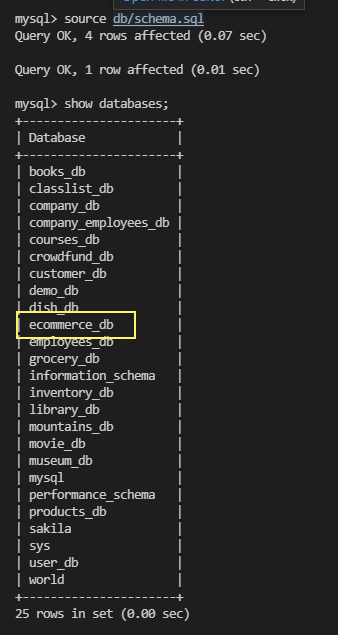

# 13 Object-Relational Mapping (ORM): E-Commerce Back End

## Description
Internet retail, also known as **e-commerce**, is the largest sector of the electronics industry, generating an estimated $29 trillion in 2019. E-commerce platforms like Shopify and WooCommerce provide a suite of services to businesses of all sizes. 

The task for this project includes building the back end for an e-commerce site by modifying starter code. I have configured a working Express.js API to use Sequelize to interact with a MySQL database.

To see how the application works click on [View Application Demo](https://drive.google.com/file/d/1OCIs2dOBlGf0Atb5ZO-5fyFlu5COS1nh/view?usp=sharing).

## Table of Contents 
- [Installation](#installation)
- [Usage](#usage)
- [Features](#features)
- [Contribute](#contribute)
- [License](#license)
- [Application-Demo](#Application-Demo)

## Installation
Users can download or clone this repository. In order to run the project, please follow the following steps:

* Navigate to the project folder and run the command 'npm install' or 'npm i'.

* Open mysql by typing 'mysql -u root -p' and enter your mysql password.

* Create the database by typing 'source db/schema.sql'.

* As shown in the image below, type 'show databases;' to see the database.

  

* Exit from the mysql typing 'quit'.

* Run 'npm run seed' to to pass the values to the database.

* Run 'source db/seeds.sql' 

* Run 'node server.js' to start the application.

## Usage

* Once the server.js file is opened, users can navigate through the Insomenia to check the functionality. The detailed E-commenrce backend functionality is shared in the walkthrough video below.

## Features
- Node.js
- MySQL 
- Express.js API
- Sequelize
- dotenv 

## Contribute
If you would like to contribute to this project please contact me via email at ajaycoolkarni@yahoo.com

## License
This project is released under the [ISC LICENSE](https://img.shields.io/badge/License-ISC-blue.svg)

## Application-Demo
This project is released under the [Application Demo](https://drive.google.com/file/d/1OCIs2dOBlGf0Atb5ZO-5fyFlu5COS1nh/view?usp=sharing)
